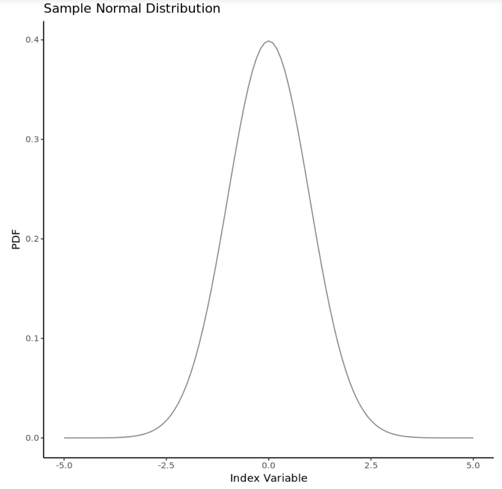

\---

layout: post

title: An Introduction to Basic Statistics

excerpt_separator:  <!--more-->

\---

# An Introduction to Basic Statistics

It's amazing how powerful basic statistics can be in the context of Machine Learning. The best data scientists leverage basic statistical methods to implement clever feature engineering and feature selection. Despite the AI evangelists insistence, nothing can replace careful data processing and handling. 

<!--more-->

I think that advances in deep learning have given the industry the *perception* that data understanding is obsolete, but this is far from the truth. For example, you can't implement good data augmentation for a CNN without understanding useful image representations of your dataset. Does a 180 degree rotation introduce error to the network, or is it a valid data augmentation technique? Well, this rotation might work well for images of cats, but could fail miserably for images of numbers. **[1]**

This blog isn't about data augmentation. Rather, it's an effort to return to basics and review some of the most common statistical methods. Below are summaries and examples of some of the most basic statistical definitions, such as skew, kurtosis, power, and sampling techniques. It also leverages some excellent libraries in R, which are always worth reviewing.

## Normal Distributions

Most people are familiar with normal distributions. They underline many physical systems, such as human height, weight, and even body temperature. This is most impressively formalized in the Central Limit Theorem, which states that some systems, with an arbitrary number of independent random variables, approach a normal distribution under addition - *even if the underlying variables aren't normally distributed themselves*. **[2]** This might seem like I'm harping on an edge case, but it's important to remember that A LOT of useful properties are additive - like the mean of a set of numbers. 

**[1]** [https://snow.dog/blog/data-augmentation-for-small-datasets](https://snow.dog/blog/data-augmentation-for-small-datasets)

**[2]** [http://mathworld.wolfram.com/CentralLimitTheorem.html](http://mathworld.wolfram.com/CentralLimitTheorem.html)